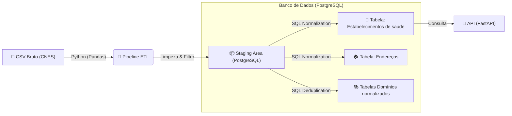

# 🏥 CNES Paraíba API - Engenharia de Dados & ELT

> API de consulta de Estabelecimentos de Saúde da Paraíba (CNES), construída com um pipeline robusto de Engenharia de Dados (ELT).


## 📄 Sobre o Projeto

Este projeto foi desenvolvido como requisito acadêmico para demonstrar o processamento de **Dados Semiestruturados e Não Conformes**. O objetivo é transformar a base bruta do governo (CNES) — que contém inconsistências e redundâncias — em um banco de dados relacional normalizado e acessível via API.

A solução implementa uma arquitetura **ELT (Extract, Load, Transform)**:
1.  **Extract:** Leitura de arquivos CSV massivos com Python/Pandas em chunks.
2.  **Load:** Carga rápida em uma área de Staging (Tabela Bruta) no PostgreSQL.
3.  **Transform:** Normalização de dados e distribuição para tabelas finais usando SQL (3ª Forma Normal).

---

## 🏗️ Arquitetura da Solução

O fluxo de dados segue o seguinte pipeline:



### Principais Funcionalidades

  * **Pipeline Resiliente:** Processamento em lotes (chunks) para não estourar a memória RAM.
  * **Staging Persistente:** Mantemos a tabela bruta (`stg_hospitais_raw`) para auditoria e *Data Lineage*.
  * **Padronização Automática:** Uso de Regex para unificar logradouros (ex: "AV.", "AVENIDA" -\> "AV").
  * **Normalização Geográfica:** Separação estrita entre dados institucionais (Hospital) e dados de localização (Endereço/Cidade).
  * **API Performática:** Endpoints assíncronos documentados automaticamente com Swagger UI.

-----

## 🛠️ Tecnologias Utilizadas

  * **Linguagem:** Python 3.x
  * **Banco de Dados:** PostgreSQL
  * **Manipulação de Dados:** Pandas
  * **API Framework:** FastAPI + Uvicorn
  * **Conector DB:** Psycopg2

-----

### 1\. Configuração do Ambiente

Clone o repositório e instale as dependências:

```bash
# Clone o projeto
git clone https://github.com/brunnofdev/cnes-pb-api.git
cd cnes-pb-api

# Crie um ambiente virtual
python -m venv venv

# Ative o ambiente (Windows)
venv\Scripts\activate
# Ou Linux/Mac
source venv/bin/activate

# Instale os pacotes
pip install -r requirements.txt
```

### 2\. Variáveis de Ambiente (.env)

Crie um arquivo `.env` na raiz do projeto com as credenciais do seu banco local:

```ini
DB_HOST=localhost
DB_PORT=5432
DB_NAME=cnes_pb
DB_USER=postgres
DB_PASS=sua_senha_aqui
```

-----

## 📂 Estrutura do Projeto

```text
cnes-pb-api/
├── app/
│   └── api.py           # Endpoints da API (FastAPI)
├── config/
│   ├── database.py      # Configuração de conexão com o Banco
│   └── paths.py         # Gerenciamento de caminhos de arquivos
├── data/
│   ├── raw/             # Onde o CSV original deve ficar
│   └── processed/       # (Gerado automaticamente) CSV temporário
├── etl/
│   ├── helpers.py       # Funções de limpeza (Regex, Padronização)
│   ├── loader.py        # Funções de interação com o PostgreSQL
│   └── pipeline.py      # Orquestrador do fluxo ETL
├── sql/
│   ├── create_raw.sql   # Criação da tabela Staging
│   ├── create_tables.sql# Criação das tabelas Finais (3FN)
│   └── normalize.sql    # Script de distribuição e normalização
├── main.py              # Ponto de entrada (CLI)
├── requirements.txt     # Dependências do projeto
└── .env.example         # Credenciais
```

## 👥 Autores

Trabalho desenvolvido pela equipe:

  * **Brunno Felipe Bezerra**
  * **Arthur Henrique Antão Pires**
  * **João Arthur Oliveira de Sousa**
